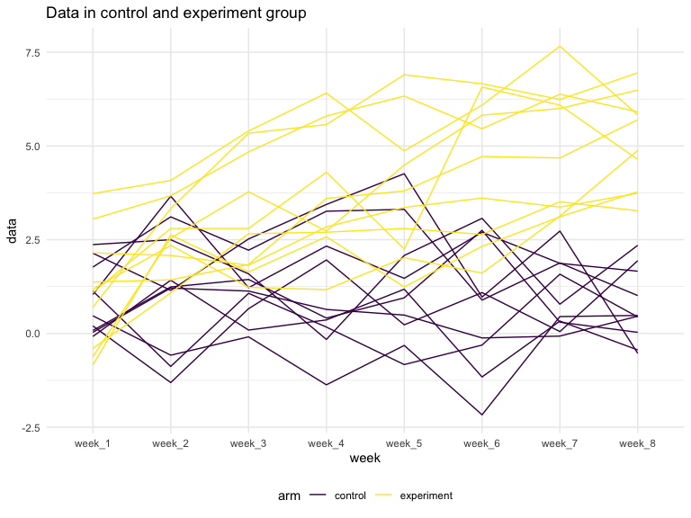

p8105\_hw5\_as5685
================

## load in data

``` r
set.seed(10)

iris_with_missing = iris %>% 
  map_df(~replace(.x, sample(1:150, 20), NA)) %>%
  mutate(Species = as.character(Species))
```

## Problem 1

#### Filling missing values

``` r
mean_function = function(x){
    
    if (is.numeric(x)) {
      x = replace_na(x,mean(x[!is.na(x)]))
    }else if (is.character(x)) {
      x = replace_na(x, "virginica")
    }
}
  
new_dataset = map_df( iris_with_missing, mean_function)
```

## Problem 2

#### Dataframe with all file names

``` r
dataframe = tibble(
  
  file = list.files("./data")

  )
```

#### Tidy dataframe for all files.

``` r
data_function = function(filename){
    
  read_csv(file = str_c("./data/", filename))
  
}

dataframe = 
  dataframe %>% 
  mutate(data = map(dataframe$file, data_function))
```

``` r
unnest_data = 
dataframe %>% 
  unnest(data)

tidy_dataset = 
  pivot_longer(
    unnest_data,
    week_1:week_8,
    names_to = "week",
    values_to = "data"
  ) %>% 
  
mutate(
  file  = str_replace(file, ".csv$", "")
)  %>% 

  rename( participant = file)
```

#### spaghetti plot

``` r
spaghetti_plot =
  tidy_dataset %>% 
  separate(participant, into = c("arm","id"), sep = "_", remove =  FALSE ) %>% 
  mutate(
    arm = recode(arm, `con` = "control", `exp` = "experiment"),
  ) %>% 
  ggplot(aes(x = week, y = data, color = arm, group = participant)) +
  geom_line() +
  labs(
    lengent = "control"
  )

spaghetti_plot
```



  - The data in experiment group generally are higher than control group
    for each week. with time, the data for experiment increases, but
    decrease for control group.

## Problem 3
